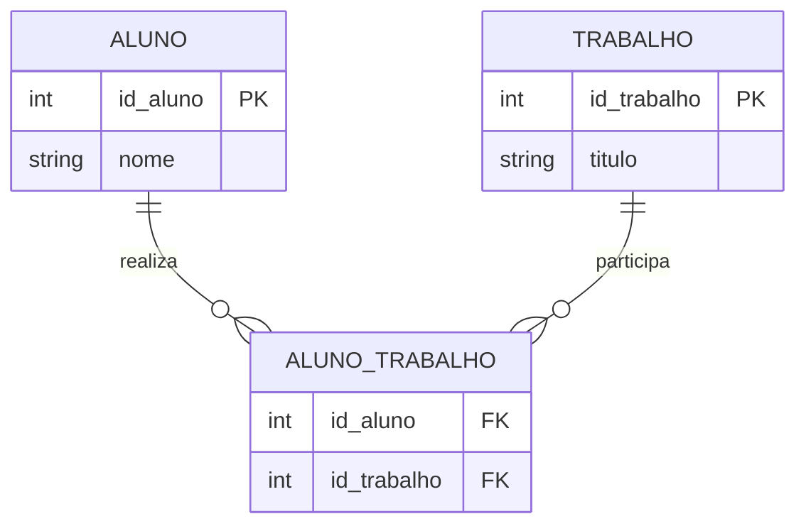
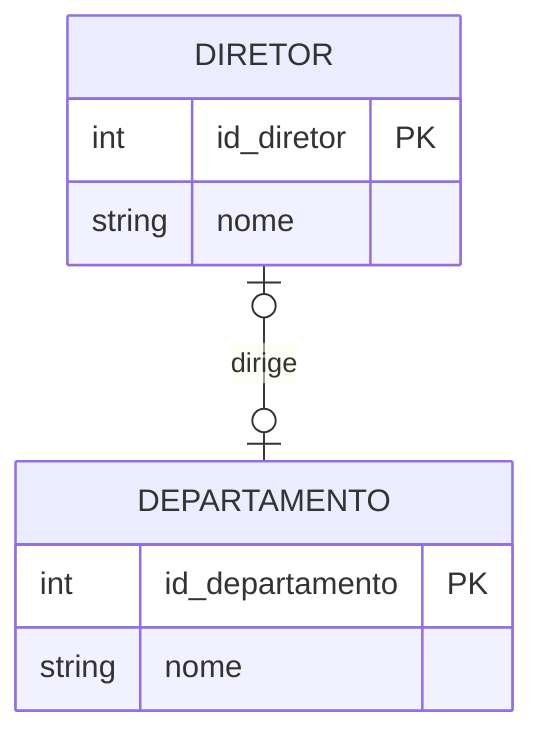
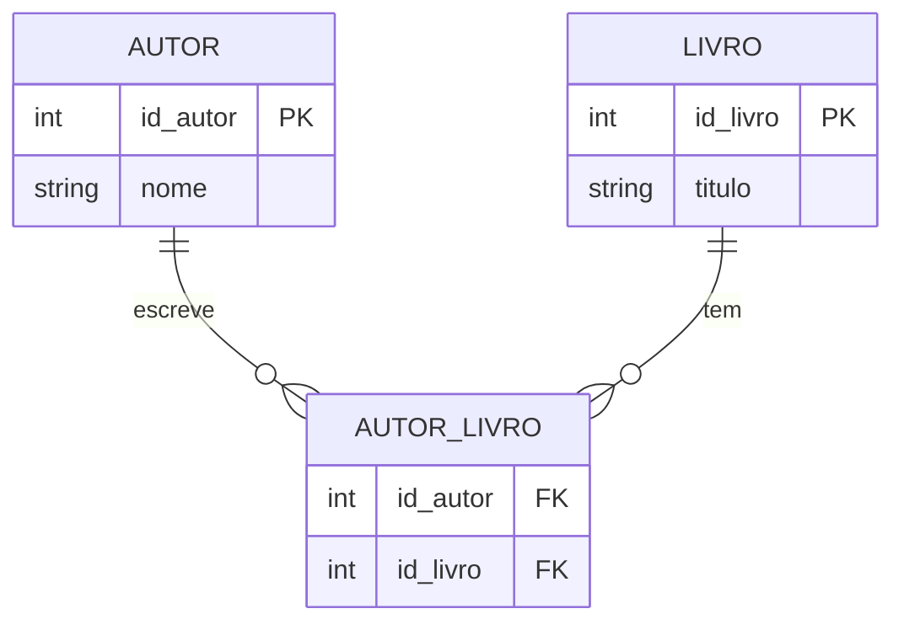
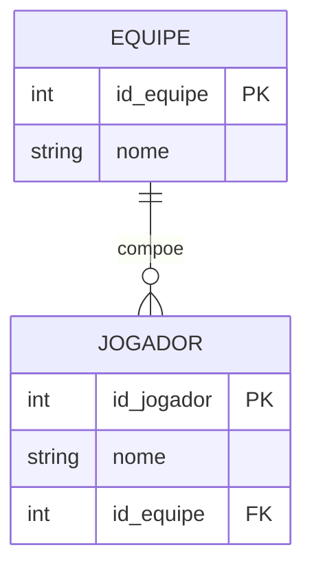
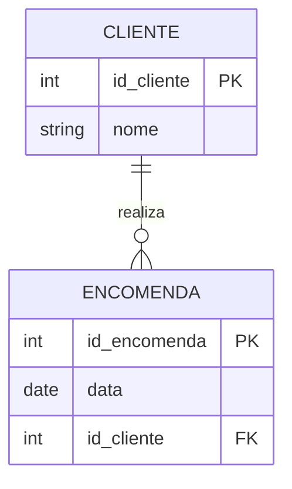

# DER - Atividade (A–E)

## A) Aluno–Trabalho (N:N)

```mermaid
erDiagram
    ALUNO ||--o{ ALUNO_TRABALHO : realiza
    TRABALHO ||--o{ ALUNO_TRABALHO : participa

    ALUNO {
        int id_aluno PK
        string nome
    }
    TRABALHO {
        int id_trabalho PK
        string titulo
    }
    ALUNO_TRABALHO {
        int id_aluno FK
        int id_trabalho FK
    }
```

## B) Diretor–Departamento (0,1)-(0,1)

```mermaid
erDiagram
    DIRETOR |o--o| DEPARTAMENTO : dirige

    DIRETOR {
        int id_diretor PK
        string nome
    }
    DEPARTAMENTO {
        int id_departamento PK
        string nome
    }
```

## C) Autor–Livro (N:N)

```mermaid
erDiagram
    AUTOR ||--o{ AUTOR_LIVRO : escreve
    LIVRO ||--o{ AUTOR_LIVRO : tem

    AUTOR {
        int id_autor PK
        string nome
    }
    LIVRO {
        int id_livro PK
        string titulo
    }
    AUTOR_LIVRO {
        int id_autor FK
        int id_livro FK
    }
```

## D) Equipe–Jogador (1:N)

```mermaid
erDiagram
    EQUIPE ||--o{ JOGADOR : compoe

    EQUIPE {
        int id_equipe PK
        string nome
    }
    JOGADOR {
        int id_jogador PK
        string nome
        int id_equipe FK
    }
```

## E) Cliente–Encomenda (1:N)

```mermaid
erDiagram
    CLIENTE ||--o{ ENCOMENDA : realiza

    CLIENTE {
        int id_cliente PK
        string nome
    }
    ENCOMENDA {
        int id_encomenda PK
        date data
        int id_cliente FK
    }
```
